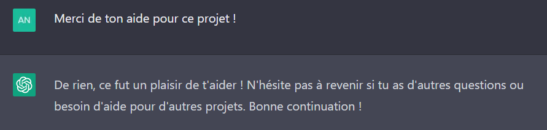

# GPT-MAP  

Un projet de jeu fait seulement avec GPT3 et des ajustements...  

## Règles du jeu  

Le but du jeu est de trouver les lieux importants indiqués par la carte.  
Pour commencer le jeu il faut cliquer sur le bouton, avant cela affiche juste la localisation de la plus belle ville de France...  
(Plus précisement les 3F pour les connaiseurs)  
Ensuite il vous suffit de rentrer votre réponse dans la case prévu a cet effet,   pour gérer le nombre de caractères différent acceptés dans la réponse vous pouvez modifier la condition "*distancel <= 10*" (ici *10* caractères).

## Développement  
Ce jeu a été entierement développé à l'aide de Chat-GPT, voulant tester son potentiel j'ai UNIQUEMENT utilisé ses réponses.  
Le seul ajustement que j'ai fait est la liste de lieu car il n'arrivait pas à la fermer...  
J'ai mis à peu près 15h (oui debugger uniquement avec ses réponses est long...) à faire ce projet, qui j'espere, vous plait.  
Il nécessite une connexion Internet afin de télécharger les bibliothèques utiles.
Une piste d'amélioration serait d'ajouter plus de lieu, je compte sur vous pour m'en suggérer.  
La bise.  
MRC-7.  

  
